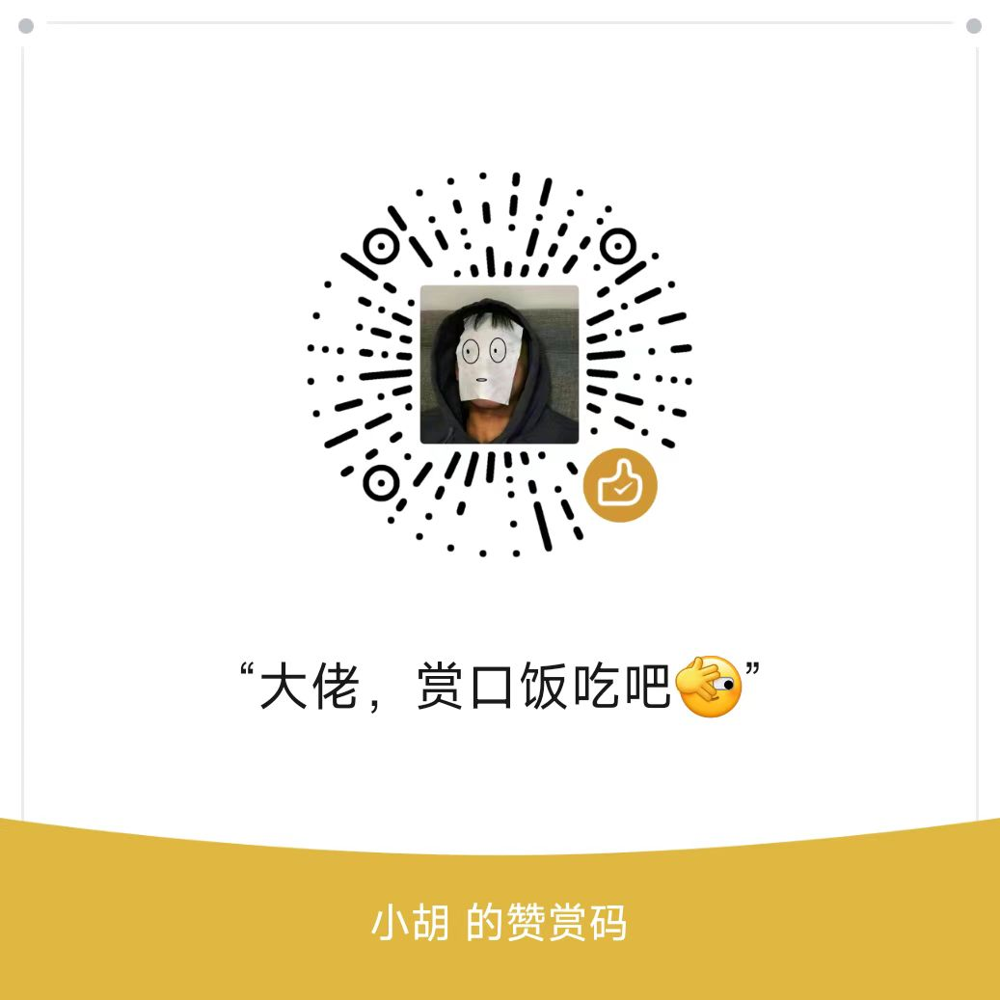

# HMusic - 智能音乐播放器 🎵

> 一款支持小米 AI 音箱的音乐播放器，**双模式支持**：xiaomusic 服务端模式 + 小米 IoT 直连模式

[](https://github.com/hpcll/HMusic/releases)

> [!IMPORTANT]
> **本项目已停止更新，新项目是 [HMusic-Server](https://github.com/hpcll/HMusic-Server) + [HMusic-App](https://github.com/hpcll/HMusic-App)。**
> v3.0.0 是这个仓库的最后一个版本，已经装上的可以继续用，但不再新增功能，也不再修问题、不再发新包。
> 小米接口变动或 xiaomusic 升级导致的失效，都只会在新项目里处理。

## 🚚 请迁移到新项目

新版把「服务端」和「客户端」拆成两个仓库，都在持续更新：

| 仓库 | 角色 | 说明 |
| --- | --- | --- |
| [HMusic-Server](https://github.com/hpcll/HMusic-Server) | 自建服务端 | 曲库、搜索解析、播放队列、下载和小爱音箱控制都由它负责，一行命令装在 NAS、Linux 服务器或长期开机的电脑上 |
| [HMusic-App](https://github.com/hpcll/HMusic-App) | 跨平台客户端 | Android、iOS、macOS、Windows、Linux，首次启动自动发现同一局域网内的 Server，移动端支持后台播放和锁屏控制 |

### 和老版本比，变化在哪

- **不再依赖 xiaomusic**：搜索解析、曲库、队列和下载改由 HMusic-Server 自己实现，原来的 xiaomusic 服务端不用再装；小米 IoT 直连模式暂时没有对应功能，见下方说明。
- **小米账号只配一次**：在 Server 的「设置 → 小米账号」登录并选择默认播放设备，家里所有客户端共用同一份队列和播放状态。
- **平台从 2 个扩到 5 个**：Android、iOS 之外还有 macOS、Windows、Linux 客户端（桌面端目前主要用来管理内容和遥控小爱音箱）。
- **数据都在你自己手上**：账号、歌单、播放历史和下载的文件都存在你自己的 Server 上，不经过任何开发者的云服务。

需要注意的是：老版本的配置和数据不能直接搬过去，Server 部署好后要重新登录一次小米账号，歌单也要重新建。

> [!NOTE]
> **原来用直连模式的用户**（只登录小米账号、不装服务端）：新版现在必须先有一台长期开机的机器跑 HMusic-Server。
> 如果暂时不方便，可以先 Star / Watch [HMusic-App](https://github.com/hpcll/HMusic-App) 关注进展 ——
> 直连模式后期有可能加回来，但目前还没有排期，也不做时间承诺。

### 怎么开始

1. 在 NAS 或长期开机的电脑上部署 Server（Windows 请在 Git Bash 里执行）：

   ```bash
   curl -fsSL https://raw.githubusercontent.com/hpcll/HMusic-Server/main/bootstrap.sh | bash
   ```

2. 用浏览器打开安装器打印的地址，后面加上 `/app/`，创建管理员账号，再到「设置 → 小米账号」登录并选择默认播放设备。
3. 从 [HMusic-App Releases](https://github.com/hpcll/HMusic-App/releases) 下载对应平台的客户端，打开后点自动发现到的 Server，用管理员账号登录即可。

详细步骤见 [Server 部署指南](https://github.com/hpcll/HMusic-Server/blob/main/docs/DEPLOYMENT.md) 和
[App 安装与故障排查](https://github.com/hpcll/HMusic-App/blob/main/docs/DEPLOYMENT.md)。

---

以下是 HMusic v3.0.0 的原始说明，留给仍在使用老版本的用户参考。

## 💬 交流群

欢迎加入 HMusic 用户交流群，一起讨论使用问题和功能建议～

<p align="center">
  
</p>

<p align="center">
  <sub>⚠️ 群二维码为动态有效期，失效请提 <a href="https://github.com/hpcll/HMusic/issues">Issue</a></sub>
</p>

## 🚀 v3.0.0 大版本更新（最终版本）

- 全新极简青绿色视觉风格，统一首页、播放页、登录页、设置页等核心界面。
- 新增外观模式设置，支持跟随系统、浅色模式和深色模式。
- 重做启动页与多平台应用图标，统一 Android、iOS、macOS、Web、Windows 图标安全边距。
- 修复 Android 边缘沉浸式体验，改善小米 10 Pro 等设备底部黑边、手势条和 dock 区域重叠问题。
- 优化播放页、曲库页、搜索页、底部导航栏和赞赏弹窗的交互与视觉细节。
- 修复直连模式曲库播放、歌单作用域、播放设备选项、熔断器和自动下一曲平台选择等问题。
- 发布 Android 通用包、Android 分架构包和 iOS unsigned IPA，并提供 SHA-256 校验文件。

> ⚠️ **重要建议（xiaomusic 用户）**  
> 为保证 HMusic v3.0.0 功能完整与稳定，建议将 xiaomusic 服务端升级到 **v0.4.23 或更高版本**。

## 📱 下载安装

从 [Releases](https://github.com/hpcll/HMusic/releases) 下载最新版本：

| 平台 | 文件 | 说明 |
|------|------|------|
| 🤖 Android 通用版 | `HMusic-v3.0.0-android-universal.apk` | 推荐，兼容大多数设备 |
| 🤖 Android arm64 | `HMusic-v3.0.0-android-arm64-v8a.apk` | 现代手机，体积更小 |
| 🤖 Android arm32 | `HMusic-v3.0.0-android-armeabi-v7a.apk` | 老旧设备 |
| 🤖 Android x86_64 | `HMusic-v3.0.0-android-x86_64.apk` | 模拟器或 x86_64 设备 |
| 🍎 iOS | `HMusic-v3.0.0-ios-unsigned.ipa` | 未签名 IPA，需自签名安装 |
| 🔐 校验和 | `checksums.txt` | SHA-256 校验文件 |

> 老版本用户通常可以直接覆盖安装升级；如遇签名冲突，请先卸载旧版本后重新安装。

## 🎯 两种模式

| | 📱 直连模式 | 🖥️ xiaomusic 模式 |
|---|---|---|
| **适合人群** | 普通用户，开箱即用 | 有 NAS/服务器的用户 |
| **需要** | 小米账号 | 部署 [xiaomusic](https://github.com/hanxi/xiaomusic) |
| **功能** | 音乐搜索、播放、音量控制 | 完整功能（本地音乐库、播放列表、进度控制） |

## ⚡ 快速开始

### 直连模式（推荐新手）

1. 打开应用 → 选择 **直连模式**
2. 登录小米账号 → 选择音箱设备
3. 搜索音乐 → 播放！

> ⚠️ **移动数据用户**：需配置音频代理，详见 [代理部署指南](cloudflare-worker/README.md)

### xiaomusic 模式

1. 先部署 [xiaomusic 服务端](https://github.com/hanxi/xiaomusic)
2. 建议升级到 **v0.4.23+**（与 HMusic v3.0.0 联动更完整）
3. 可参考官方文档站：[https://xdocs.hanxi.cc/](https://xdocs.hanxi.cc/)
4. 打开应用 → 选择 **xiaomusic 模式**
5. 输入服务器地址和认证信息

## 📚 文档

- [常见问题 FAQ](docs/FAQ.md)
- [代理部署指南](cloudflare-worker/README.md)
- [更新日志](CHANGELOG.md)
- [开发者文档](ARCHITECTURE.md)

---

## 🙏 致谢

感谢 [xiaomusic](https://github.com/hanxi/xiaomusic) 项目及其开发者 [@hanxi](https://github.com/hanxi)，HMusic 的 xiaomusic 模式基于该项目实现，直连模式的小米 IoT API 也参考了相关实现。

---

---

## ☕ 请作者喝杯咖啡

如果 HMusic 对你有帮助，欢迎请作者喝杯咖啡～ 你的支持是我持续开发的动力！

<p align="center">
  
  &nbsp;&nbsp;&nbsp;&nbsp;
  
</p>

<p align="center">
  <b>微信赞赏</b>
  &nbsp;&nbsp;&nbsp;&nbsp;&nbsp;&nbsp;&nbsp;&nbsp;&nbsp;&nbsp;&nbsp;&nbsp;&nbsp;&nbsp;&nbsp;&nbsp;&nbsp;&nbsp;&nbsp;&nbsp;&nbsp;&nbsp;&nbsp;&nbsp;&nbsp;&nbsp;&nbsp;&nbsp;&nbsp;&nbsp;
  <b>支付宝</b>
</p>

---

## 📜 许可证

[AGPL-3.0](LICENSE) - 开源免费，商业使用需授权
